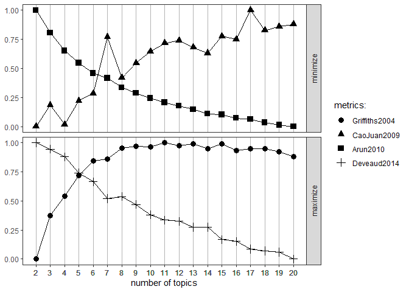

# Intention

This is a small explorative analysis of some publicly available Airbnb datasources hosted on http://insideairbnb.com/get-the-data.html, mainly focusing on using the *tm*, *ldatuning* and *topicmodelling* NLP packages.


```r
library(data.table)
library(textcat)
library(tm)
library(Rmpfr)
library(ldatuning)
library(topicmodels)
```

# Preparation

## Getting the data

The detailed reviews and listings csv-s are downloaded from the website directly. However, since they are zipped first they have to be unzipped, then read with *data.table* which is way quicker than the built in read.table on files like these.


```r
datasources = "reviews"
root_url = "http://data.insideairbnb.com/france/ile-de-france/paris/2020-03-15/data/"

for (source in datasources){
  download.file(paste0(root_url, source, ".csv.gz"), 
                paste0(source, ".csv.gz"))
}

for(source in datasources) {
  assign(source, fread(paste0(source, ".csv.gz")))
}
```

## Data cleansing

Since I took the Parisian reviews in this example, chances are there are a lot of French reviews as well (along with the standard English ones). So first the languages have to be identified for every review, as different languages call for different ways to handle them. I'll also take a smaller sample to save computation time. Set the seed for reproductability.


```r
set.seed(69)
review_sample = sample(reviews$comments, 1000)

# Predict the language
review_lang = textcat(review_sample)
sort(table(review_lang), decreasing = T)[1:5]
```

```
## review_lang
## english  french spanish   scots  german 
##     591     239      39      18      17
```
~ 591 English reviews are present in the sample, which is the grand majority. We will use these for the analysis.


```r
review_sample = as.data.frame(cbind(review_sample, review_lang))

# Create a subset of the English reviews
reviews_en = as.character(review_sample$review_sample[which(review_sample$review_lang == 'english')])
```

## Processing the texts

Processing the texts starts by creating a corpus of the reviews. Afterwards I'll apply various data cleansing techniques (removing white spaces, punctuations etc.). I will periodicly inspect a line to demostrate the progress of the cleansing.


```r
reviews_corp = Corpus(VectorSource(reviews_en))
writeLines(as.character(reviews_corp[[1]]))
```

```
## We had a great stay at Erwan's place. The room was much much more than our expectations, great location, clean, and nice view. Strongly recommend!
```
This is the baseline. A full, punctiated English sentence. Appears to be a great Airbnb.


```r
# Create a function to apply the different cleansings

clean_corpus <- function(corpus){
  corpus <- tm_map(corpus, stripWhitespace)
  corpus <- tm_map(corpus, removePunctuation)
  corpus <- tm_map(corpus, removeNumbers)
  corpus <- tm_map(corpus, content_transformer(tolower))
  corpus <- tm_map(corpus, removeWords, stopwords("en"))
  corpus <- tm_map(corpus, stemDocument)
  return(corpus)
}

# Apply the function
clean_corp <- clean_corpus(reviews_corp)

# Check on the results
writeLines(as.character(clean_corp[[1]]))
```

```
## great stay erwan place room much much expect great locat clean nice view strong recommend
```

Easy to see how all the unwanted elements (words, symbols), that caried no value or information were removed. Also all the words have been reduced to their stems. Next, I will complete the stems.


```r
# As of now the standard stemCompletion function does not work properly, this function properly completes the stemming
stemCompletion_mod = function(x, dict = reviews_corp) {
  PlainTextDocument(stripWhitespace(paste(stemCompletion(unlist(strsplit(as.character(x)," ")),
                                                         dictionary = dict,
                                                         type = "short"),
                                          sep = "",
                                          collapse = " ")))
}

reviews_corp_comp = lapply(clean_corp, stemCompletion_mod, dict = reviews_corp)
writeLines(as.character(reviews_corp_comp[[1]]))
```

```
## great stay NA place room much much expect great locate clean nice view strongly recommend
```

After the stemcompletion is done the format has changed to large list with more attributes which is not supported by the dtm function. We have to substract the main information and transform back to corpus removing the newly added stringparts and prepare to be fed to the dtm function.


```r
reviews_corp_comp = lapply(reviews_corp_comp, function (x) x['content'])
reviews_corp_comp = Corpus(VectorSource(reviews_corp_comp))

remove_extended_reg_ex <- function(corpus){
  toSpace = content_transformer(function(x, pattern) { return (gsub(pattern, ' ', x, fixed = TRUE))})
  corpus = tm_map(corpus, toSpace, 'list(content = "')
  corpus = tm_map(corpus, toSpace, '")')
  return(corpus)
}

reviews_corp_final = remove_extended_reg_ex(reviews_corp_comp)
writeLines(as.character(reviews_corp_final[[1]]))
```

```
##  great stay NA place room much much expect great locate clean nice view strongly recommend
```

Create the document-term matrix, and calculate a couple of descriptives to check.


```r
# Create document-term matrix
review_dtm = DocumentTermMatrix(reviews_corp_final)

# Collapse matrix by summing over columns
freq = colSums(as.matrix(review_dtm))
```
10 most frequent terms

```r
sort(freq, decreasing = T)[1:10]
```

```
##  apart   stay locate  great  place  paris   host  clean   nice  metro 
##    389    328    326    320    265    234    170    161    161    147
```
Total number of terms

```r
length(freq)
```

```
## [1] 1782
```

# Analysis

## Estimating the optimal number of topics

### Topic modelling

As with every non-supervised algorithm, first we have to calcualte the optimal number of topics (sort of clusters). I'm going to use 2 different methodologies and then compare the results and set the number of topic for the Latent Dirichlet allocation.


```r
# Estimate the number of topics to set - Parameter tuning by boosting
# Set parameters for Gibbs sampling
k = 20
burnin = 1000
iter = 1000
seed = list(2003, 5, 63)
nstart = 3
keep = 50

control = list(nstart = nstart, seed = seed, burnin = burnin, iter = iter, keep = keep)

topic_number = FindTopicsNumber(
  review_dtm,
  topics = seq(from = 2, to = k, by = 1),
  metrics = c("Griffiths2004", "CaoJuan2009", "Arun2010", "Deveaud2014"),
  method = "Gibbs",
  control = control,
  mc.cores = 4L,
  verbose = F
)

FindTopicsNumber_plot(topic_number)
```

<!-- -->
We can see that not all the calculated metrics show definitive results. Caojuan and Deveaud seems to work contraprodutively, while Griffits and Arun doesn't seem to have the same results. This calls for more inverstigation.

### Using Harmonic means

Apart from using obscure R packages (of course this is not the case, just trying to make it a little more dramatic), we can also calculate the harmonic means and use that to establish the optimal number of topics for LDA, as explained by Martin Ponweiser in his thesis on the subject (http://epub.wu.ac.at/3558/1/main.pdf).

```r
# The log-likelihood values are determined by first fitting a model
harmonicMean = function(logLikelihoods, precision = 2000L) {
  llMed = median(logLikelihoods)
  as.double(llMed - log(mean(exp(-mpfr(logLikelihoods,
                                       prec = precision) + llMed))))
}

# Generate numerous topic models with different numbers of topics
sequ = seq(2, k, 1)
fitted_many = lapply(sequ, function(k) LDA(review_dtm, k = k, method = "Gibbs", control = control))

# Extract loglikelihoods from each topic
logLiks_many = lapply(fitted_many, function(L)  L@logLiks[-c(1:(burnin/keep))])

# Compute harmonic means using the harmonicMean function
hm_many = sapply(logLiks_many, function(h) harmonicMean(h))

# Plot the results
plot(sequ, hm_many, type = "l", main = 'Optimal Number of topics', xlab = 'Number of topics', ylab = 'Harmonic mean')
```

<!-- -->


```r
# Compute optimum number of topics
hm_many
```

```
##  [1] -90277.25 -86276.76 -84527.33 -82585.79 -81289.65 -81088.41 -80082.96
##  [8] -79924.29 -79979.03 -79591.90 -79867.67 -79687.50 -80119.25 -79702.83
## [15] -80330.66 -80125.13 -80168.50 -80415.52 -80851.93
```

```r
k = sequ[which.max(hm_many)]
k
```

```
## [1] 11
```

The result is `11`, which looks plausible, because it seems to correlate with the earliest peak of the Griffits line, so that's the numebr of topics I'm going to use.

Now that we've estimated the optimal number of topics it' time toRun Latent Dirichlet allocation using Gibbs sampling.

# Latent Dirichlet allocation
## Run the model

```r
lda = LDA(review_dtm, k, method = 'Gibbs', control = control)

# Docs to topics
lda_topics = as.matrix(topics(lda))
lda_topics_sum = table(lda_topics)
```

## Understand the results

Checking the top N term in each topic, to get a grasp of understanding them

```r
# Top n terms in each topic
n = 6
lda_terms = t(as.matrix(terms(lda, n)))
lda_terms = cbind(lda_terms, lda_topics_sum)

col_list = c()
for (i in seq(1:n)) {
  name = c(paste0('word_', i))
  col_list = c(col_list, name)
}

colnames(lda_terms) <- c(col_list, 'topic_freq')
lda_terms
```

```
##          word_1      word_2       word_3   word_4        word_5      
## Topic 1  "everythng" "just"       "check"  "paris"       "wonderful" 
## Topic 2  "paris"     "recommend"  "help"   "high"        "thank"     
## Topic 3  "good"      "get"        "one"    "small"       "night"     
## Topic 4  "great"     "locate"     "host"   "need"        "well"      
## Topic 5  "arrive"    "day"        "time"   "stay"        "need"      
## Topic 6  "apart"     "also"       "easily" "station"     "experience"
## Topic 7  "stay"      "flat"       "love"   "locate"      "help"      
## Topic 8  "nice"      "comfort."   "room"   "bed"         "clean"     
## Topic 9  "perfect"   "easily"     "clean"  "communicate" "area"      
## Topic 10 "walk"      "close"      "metro"  "restaurant"  "near"      
## Topic 11 "place"     "definitely" "even"   "amazing"     "clean"     
##          word_6         topic_freq
## Topic 1  "away"         "53"      
## Topic 2  "minute"       "52"      
## Topic 3  "paris"        "50"      
## Topic 4  "shop"         "86"      
## Topic 5  "locate"       "51"      
## Topic 6  "neighborhood" "55"      
## Topic 7  "everythng"    "46"      
## Topic 8  "bathroom"     "50"      
## Topic 9  "stay"         "53"      
## Topic 10 "around"       "51"      
## Topic 11 "love"         "44"
```
We can see that most of the comments are positive, and there is a lot of overlap between categories. However, there are still some relative distinct topics as well.

For example:
- Topic 4 has the reviews that's main point is the location itself (the first 2 most important words are great, and location). Also shopps are mentioned.
- Topic 6 mentions the easy approachability and the importance of the neightbourhood as well, not just the general distance to things.
- Topic 8 cares more about the apartmant itself. That it was clean and comfortable. 
And so on. Printing more words can also help identifying the essence of the topics.

Finally, we can se the probabilities of the words and topics as well.


```r
# Probabilities associated with each topic assignment
topic_prob = lda@gamma
topic_result = cbind(topic_prob, lda_topics)
colnames(topic_result)[k+1] = 'result no.'
topic_result[1:5,]
```

```
##         <NA>       <NA>       <NA>       <NA>       <NA>       <NA>
## 1 0.08664773 0.10227273 0.07102273 0.13352273 0.07102273 0.07102273
## 2 0.08664773 0.07102273 0.07102273 0.08664773 0.08664773 0.08664773
## 3 0.10463122 0.08576329 0.08576329 0.08576329 0.08576329 0.08576329
## 4 0.07974482 0.07974482 0.07974482 0.09728868 0.18500797 0.07974482
## 5 0.08727273 0.08727273 0.10060606 0.07393939 0.08727273 0.06060606
##         <NA>       <NA>       <NA>       <NA>       <NA> result no.
## 1 0.08664773 0.11789773 0.10227273 0.07102273 0.08664773          4
## 2 0.10227273 0.08664773 0.08664773 0.13352273 0.10227273         10
## 3 0.08576329 0.10463122 0.08576329 0.08576329 0.10463122          1
## 4 0.07974482 0.07974482 0.07974482 0.07974482 0.07974482          5
## 5 0.11393939 0.07393939 0.11393939 0.08727273 0.11393939          7
```
